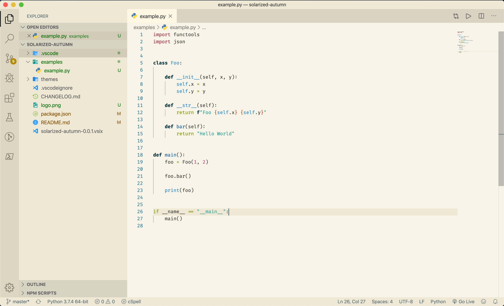
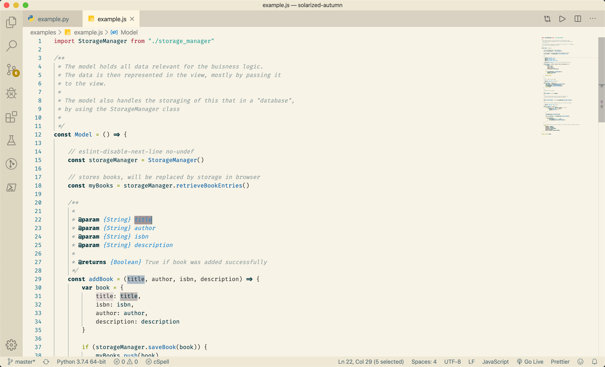

# 
Solarized Autumn

This VS Code Color Theme is based on the build in Solarized Light, but uses stronger colours for tokens and a light bit lighter editor background.

The colors remind me of autumn, that's why the name...

## Screenshots

<h1 align="center">
  
</h1>

<h1 align="center">
  
</h1>

For now only light theme
